# reading-notes

Link to repository:  [https://ghofranjdaradkh.github.io/reading-notes/]

## Code 102 - Intro to Software Development

## Code 201 - Foundations of Software Development

## Code 301 - Intermediate Software Development

## Code 401 - Advanced Software Development

## SQL Practice
-exercise  1
<pre>
SELECT statement is used to retrieve data from a database table. It allows you to specify the columns you want to retrieve .
</pre>
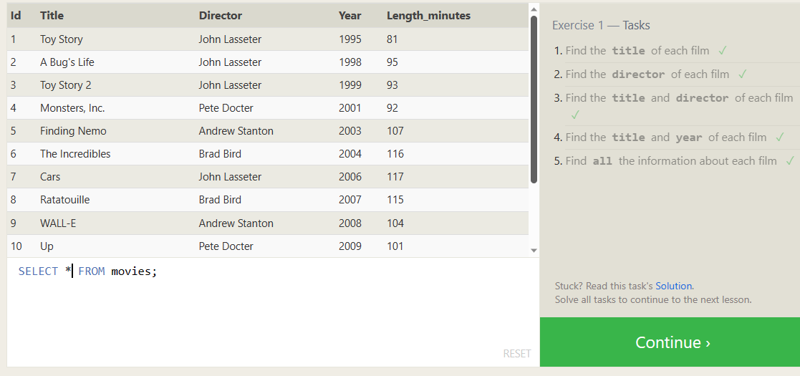
-----
-exercise  2
<pre>
In SQL, there are several useful operators that help you manipulate data like:
 AND,OR :operators are used to combine multiple conditions in the WHERE clause.
*AND* :requires all conditions to be true for a row to be included in the result set.
*OR*: requires at least one of the conditions to be true .
**BETWEEN** operator is used to filter rows based on a range of values.

</pre>
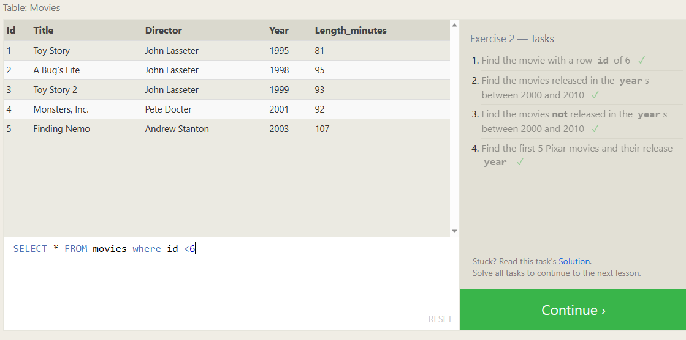

----
 -exercise  3
<pre>
Another operators used in SQL
**IN** operator is used to specify multiple values for a column
LIKE operator is used for pattern matching in the WHERE clause. 
It is commonly used with wildcard characters '%' (matches any sequence of characters) and '_' (matches any single character)

</pre>
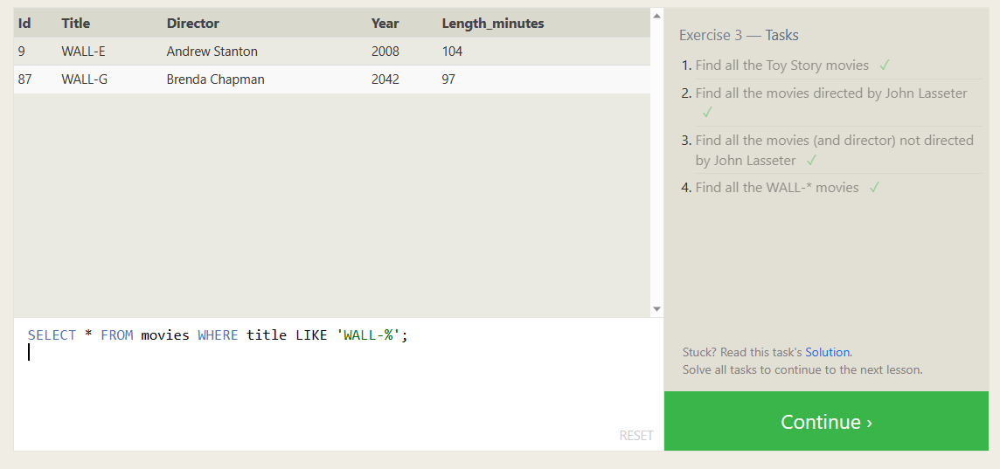
----

 -exercise  4
<pre>
Filtering and sorting Query results 
 DISTINCT keyword and ORDER BY clause are used to filter and sort query results.
  DISTINCT used to eliminate duplicate rows from the result set
ORDER BY clause is used to sort the result set based on one or more columns in ascending order or  descending order

</pre>
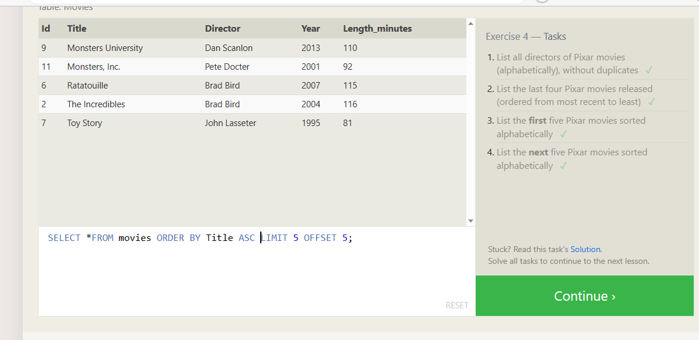

-----
 -exercise  5
<pre>
Review and solve some of problems

</pre>
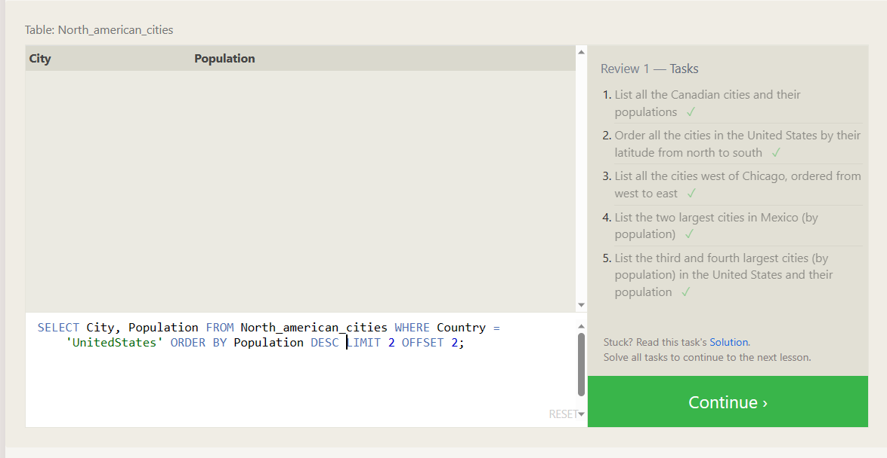

-----
 -exercise  6
<pre>
Multi-table queries with JOINs
INNER JOIN: is a powerful tool for combining data from related tables, and it is commonly used in multi-table queries to retrieve information from different parts of a database.

</pre>
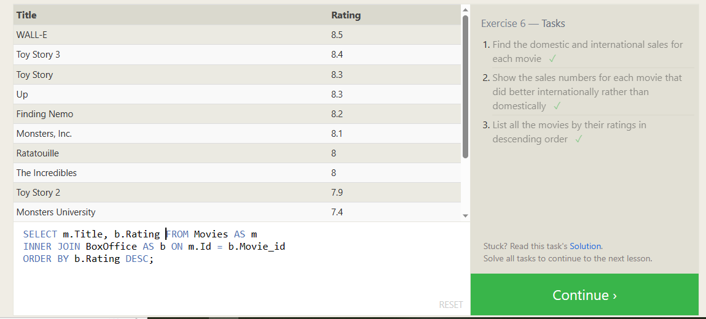

----------

-exercise  13
<pre>
 Inserting rows:
 INSERT INTO statement is used to add new rows (records) to a table. It allows you to insert data into specific columns or all columns of the table

</pre>
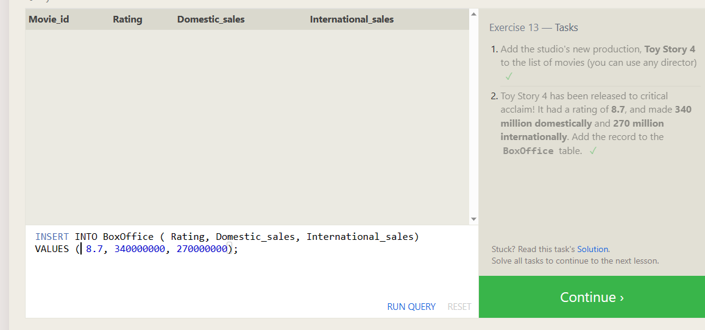
-------
-exercise  14
<pre>
Updating rows
  UPDATE statement is used to modify existing rows (records) in a table. It allows you to change the values of one or more columns for specific rows that match a specified condition
</pre>
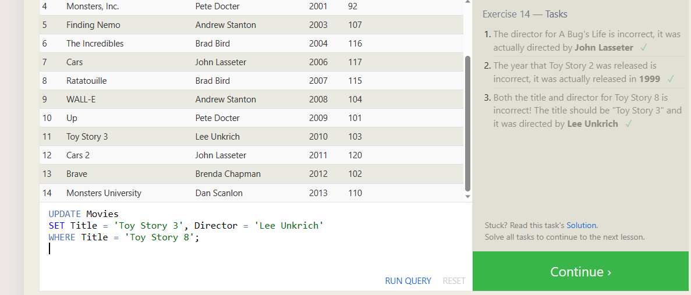

------------
-exercise  15
<pre>
Deleting  rows
  DELETE statement is used to remove rows (records) from a table. It allows you to delete specific rows that match a specified condition or delete all rows from the table
</pre>
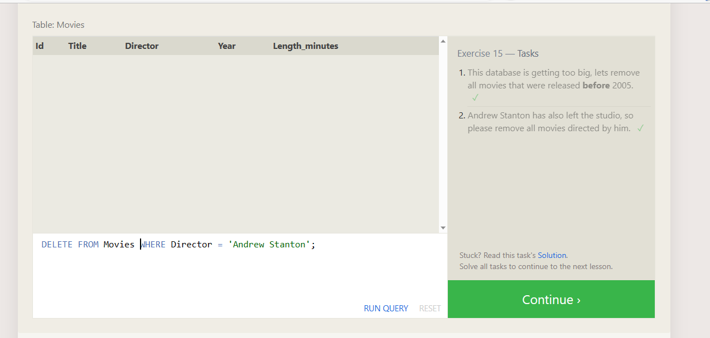
------------
-exercise  16
<pre>
Creating tables
 CREATE TABLE statement is used to create a new table in the database ,including the names and data types of the columns.
</pre>
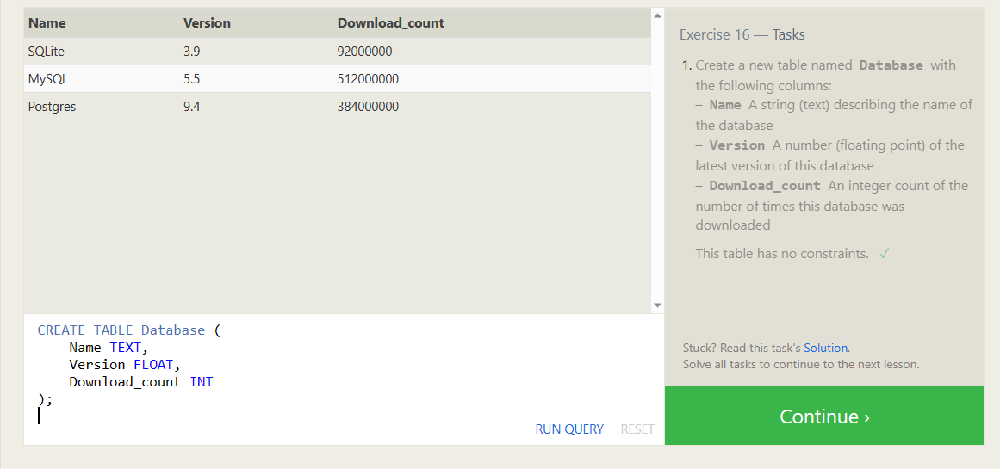
-------------

-exercise  17
<pre>
Altering tables
  ALTER TABLE statement is used to modify an existing table's structure. It allows you to add, modify, or drop columns.
</pre>
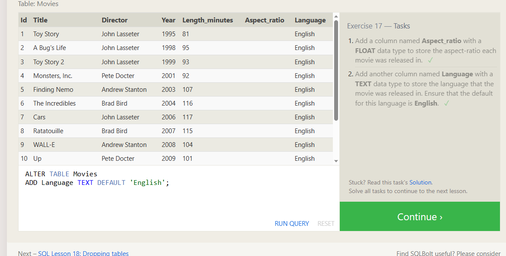
---------------
-exercise  18
<pre>
Dropping tables
  DROP TABLE statement is used to remove an existing table and all its data from the database.
</pre>
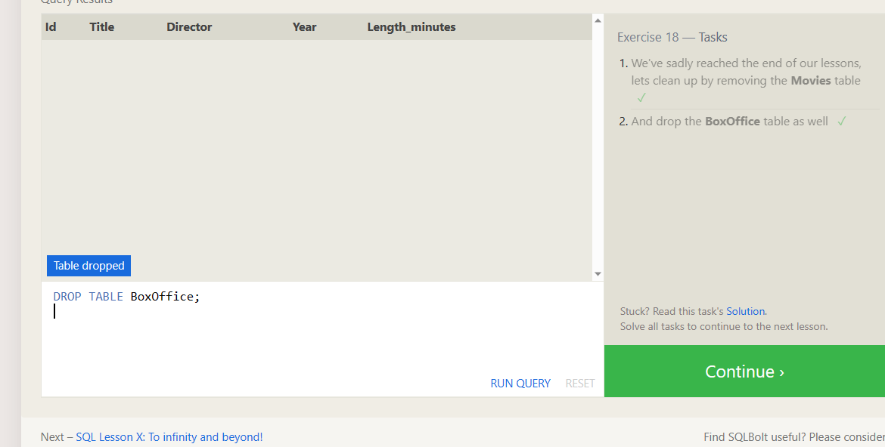