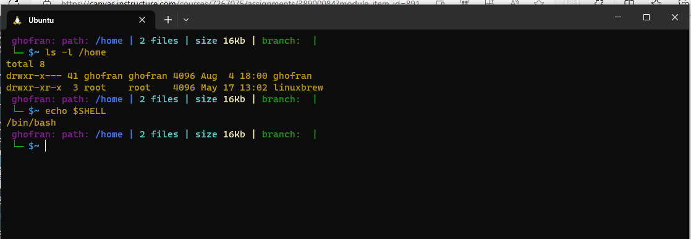
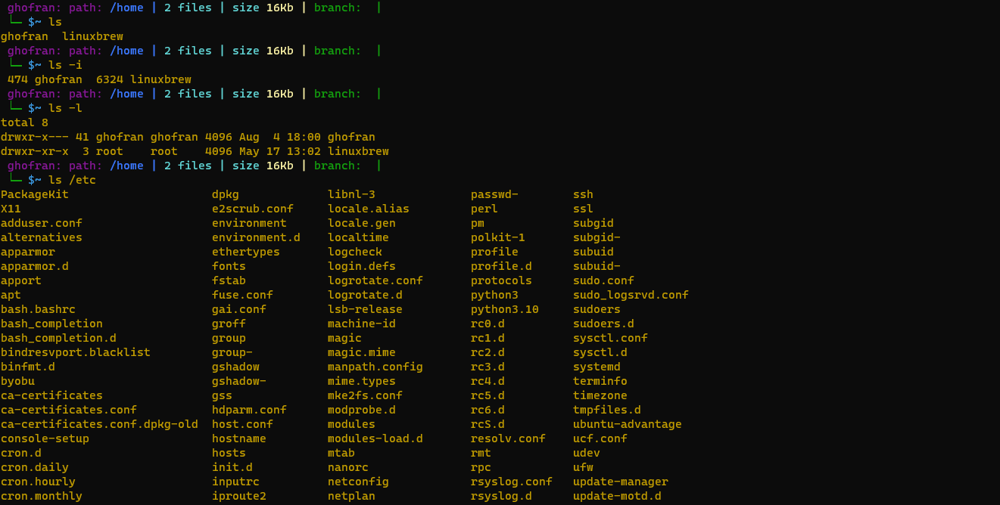
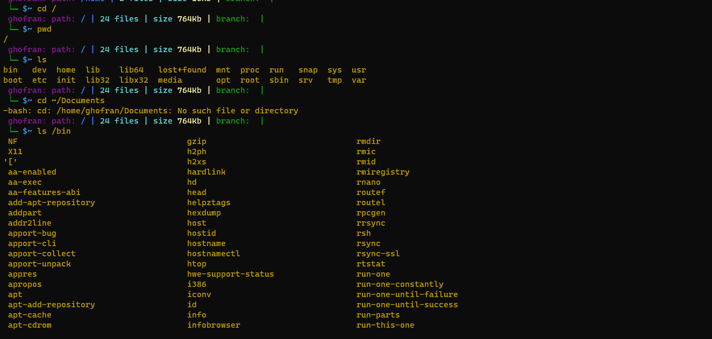

# Practice-Terminal :

 ## command line 
# What is it, how does it work and how do I get to one.
The terminal is a text-based interface that provides a way for users to interact with the operating system through commands. It allows users to perform various tasks, such as navigating directories (using commands like cd), executing programs, manipulating files (using commands like mkdir to create directories, rmdir to remove directories, mv to move or rename files, and ls to list directory contents), and much more

---------------------------------------------------------------------------------------------------------------------------

## Basic Navigation 

basics of moving around the system
# some commands:
pwd
Print Working Directory - ie. Where are we currently.
ls
List the contents of a directory.
cd
Change Directories - ie. move to another directory.

pathes : A path is a means to get to a particular file or directory on the system.
Relative path
A file or directory location relative to where we currently are in the file system.
Absolute path
A file or directory location in relation to the root of the file system.

-----------------------------------------------------------------------------------------------------------------------------------

## More About File :

 1.Everything is a File (or Directory): everything is actually a file. A text file is a file, a directory is a file, your keyboard is a file (one that the system reads from only), your monitor is a file

2.Linux is Case Sensitive: that it distinguishes between uppercase and lowercase letters in file and directory names.
3.Hidden Files and Directories:Files and directories that start with a dot (.) are considered hidden.
4.Linux is an extensionless system :Files can have any extension they like or none at all.
5.Spaces in names:Spaces in file and directory names are perfectly valid but we need to be a little careful with them

command :
file
obtain information about what type of file a file or directory is.
ls -a
List the contents of a directory, including hidden files.

---------------------------------------------------------------------------------------------------------------------------------------

## Manual Pages :

he manual pages are a set of pages that explain every command available on your system including what they do, the specifics of how you run them and what command line arguments they accept and designed to help users understand and effectively use utilities, functions, and system components.
also it is possible to do a keyword search on the Manual pages
# commands:
man <command>
Look up the manual page for a particular command.

man -k <search term>
Do a keyword search for all manual pages containing the given search term.

/<term>
Within a manual page, perform a search for 'term'
n
After performing a search within a manual page, select the next found item.

---------------------------------------------------------------------------------------------------------------------------------------

## File Manipulation
 # Creating Files and Directories:

create a new file: touch filename.txt
create a new directory: mkdir dirctory name
 # Copying and Moving Files:
 copy a file: cp 
 copy a directory: cp -r 
 
# Removing Files and Directories:

 remove a file: rm filename
 remove a directory a: rmdir

# Moving 
 move or rename a file or directory: mv 

---------------------------------------------------------------------------------------------------------------------------------------
 
 ## Cheat Sheet

 A Linux tutorial cheat sheet provides quick-reference information and commands for various tasks in a Linux command-line environment. It contains all the necessary commands to navigate, manipulate files, manage processes, and perform tasks within the command-line environment.
---------------------------------------------------------------------------------------------------------------------------------------

## Images :

